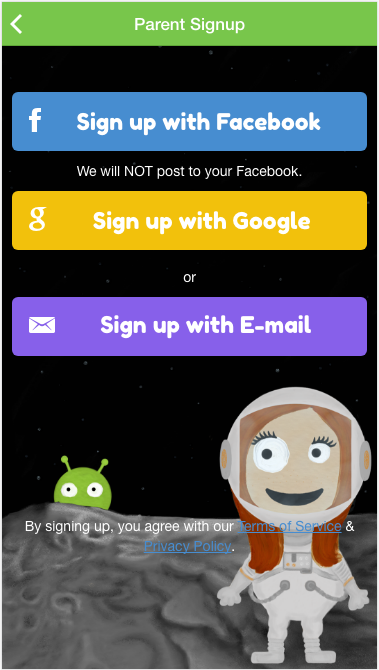

# Ionic chatapp

## Screenshots

## Main Features

#### *Chat feature
#### *Social media integration

### Sources

### Report issue
Did you encounter bugs? Report them [here](https://github.com/AdminDev826/ionic_simplechatapp/issues). The more relevant information you provide the easier and faster it can be resolved.

## License
